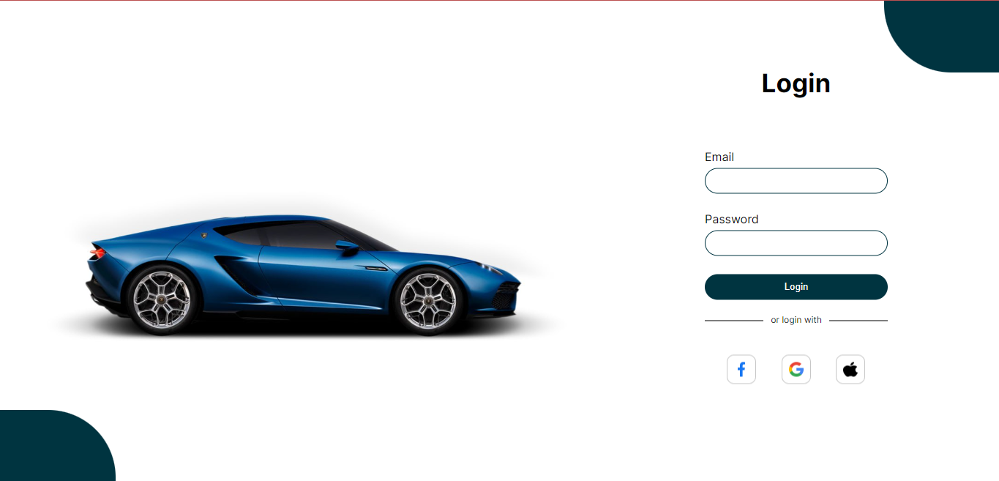

Login Page

<h2>About the project</h2>

  
A <b>Login Page</b> is a responsive Page template built with HTML and CSS. It is a modern and minimalist template that is perfect for a variety of websites, including portfolios, blogs, and business websites.

<h5>Feature:</h5>
<ul>
  <li>A modern and minimalist design</li>
  <li>Fully responsive layout</li>
  <li>Clean and uncluttered code</li>
  <li>Easy to customize</li>
  <li>Well-documented code</li>
</ul>

👉 Live Demo: <a href='https://car-login-page.vercel.app/'>Live Demo</a>

<h3>Build with:</h3>

» HTML  
» CSS

<h2>Screenshots of the Project 📸</h2>
 
<h3 align='center'>Login Page 🏡</h3>

